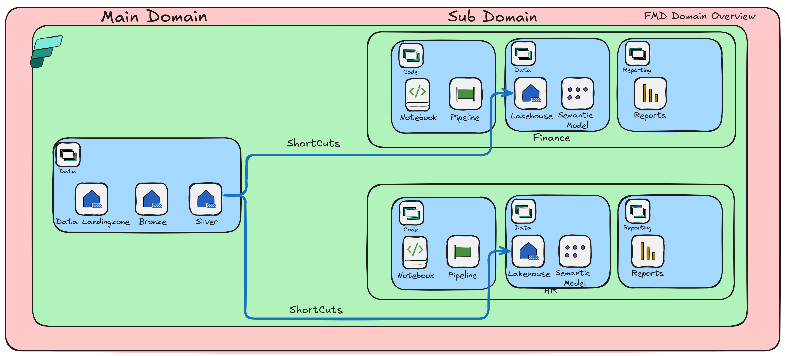

# Deploy the FMD Framework


This article describes how to deploy the Fabric Metadata-Driven (FMD) Framework (FMD_FRAMEWORK) in Microsoft Fabric. Follow these steps to configure your environment, set up required connections, and apply deployment settings.

## Prerequisites

Before you begin, ensure the following prerequisites are met:

- Users can create Fabric items.
- Fabric SQL database is available.
- Contributor role is assigned on the target capacity or capacities.

## Deployment steps

### 1. Download deployment assets

Download the deployment notebook from the setup folder to your local machine:

- `NB_SETUP_FMD.ipynb` – Automates artifact creation for FMD_FRAMEWORK in Fabric, based on your configuration.

### 2. Create required connections

Set up the following connections and note their Connection IDs for later configuration:

| Connection name              | Connection type         | Authentication |
|------------------------------|------------------------|----------------|
| CON_FMD_FABRIC_PIPELINES     | Fabric Data Pipelines  | OAuth2         |
| CON_FMD_FABRICSQL            | Fabric SQL database    | OAuth2         |

If you use Azure Data Factory Pipelines, create this additional connection:

| Connection name              | Connection type         | Authentication |
|------------------------------|------------------------|----------------|
| CON_FMD_ADF_PIPELINES        | Azure Data Factory     | OAuth2         |

### 3. Create a configuration workspace

- Create a new workspace (for example, `FMD_FRAMEWORK_CONFIGURATION`).
- Import the deployment notebook into the workspace (ensure you are in the Fabric Experience):
  - `NB_SETUP_FMD.ipynb`


### 4. Configure deployment settings

Open `NB_SETUP_FMD.ipynb` and navigate to the configuration cell. Update the following parameters as needed.

#### Key configuration parameters

**Configuration and Parameters**

> [!NOTE]
> Fabric Administrator Role is required to create domain. Otherwise disable creation of Domains in next step


Define the name for the Main Domain, and you can add 1 or mire sub domains

```python

FrameworkName = 'DEMO'              # max 6 characters, no spaces
assign_icons = True                 #Leave on True if you "want to assign the default icons to the workspaces, set on false if you  have already assigned your own

load_demo_data_data= True           # Set to True if you want to load the demo data, otherwise set to False
lakehouse_schema_enabled = True     # Set to True if you want to use the lakehouse schema, otherwise set to False
```

**Capacity settings**  
  Specify the unique name for the capacity:

  ```python
  capacity_name_dvlm = 'Name of your capacity'
  ```

**Domain settings**

Define the name for the Main Domain, and you can add 1 or mire sub domains

```python
create_domains=  True                               # If you do not have a Fabric Admin role, you need to set this option to False. For domain creation the Fabric Admin role is needed
domain_name='FMD'                                   # Main Domain
sub_domain_names= ['FINANCE','SALES']               # Create business domains(sub)
domain_contributor_role = {"type": "Contributors","principals": [{"id": "00000000-0000-0000-0000-000000000000","type": "Group"}  ]}  # Which group/user can add or remove workspaces to this domain
```

**Workspace roles settings**  
  Assign security roles to workspaces:


You need to create workspace roles for the different workspaces:

workspace_roles_code
workspace_roles_data
workspace_roles_configuration


Check the example below
  ```python
  workspace_roles_data = [
      {
          "principal": {
              "id": "00000000-0000-0000-0000-000000000000",
              "type": "Group"
          },
          "role": "Member"
      },
      {
          "principal": {
              "id": "00000000-0000-0000-0000-000000000000",
              "type": "Group"
          },
          "role": "Admin"
      }
  ]
  ```
**Configuration settings  (Fabric Database)**  
    Define settings for the configuration database. The database where all the metadata is stored. Do not change if not necassary.

  
```python
configuration = {
                    'workspace': {
                        'name' : FrameworkName + ' CONFIG FMD',             # Name of target workspace
                        'roles' : workspace_roles_data,                     # Roles to assign to the workspace
                        'capacity_name' : capacity_name_config              # Name of target capacity for the configuration workspace
                    },
                       'DatabaseName' : 'SQL_'+FrameworkName+'_FRAMEWORK'   # Name of target configuration SQL Database
}
  ```

**Workspace configuration**  
  Define settings for each environment (for example, development and production). You can add multiple environments as needed. Each environment should include workspace configurations, roles, capacity IDs, and connection details.

  ```python
  environments = [
      {
          'environment_name': 'development',
          'workspaces': {
              'data': {
                  'name': 'FMD_FRAMEWORK_DATA (D)',
                  'roles': workspace_roles_data,
                  'capacity_name': capacity_name_dvlm
              },
              'code': {
                  'name': 'FMD_FRAMEWORK_CODE (D)',
                  'roles': workspace_roles_code,
                  'capacity_name': capacity_name_dvlm
              }
          },
          'connections': {
              'CON_FMD_FABRIC_SQL': '372237f9-709a-48f8-8fb2-ce06940c990e',
              'CON_FMD_FABRIC_PIPELINES': '6d8146c6-a438-47df-94e2-540c552eb6d7',
              'CON_FMD_ADF_PIPELINES': '02e107b8-e97e-4b00-a28c-668cf9ce3d9a'
          }
      },
      {
          'environment_name': 'production',
          'workspaces': {
               'data': {
                  'name': 'FMD_FRAMEWORK_DATA (P)',
                  'roles': workspace_roles_data,
                  'capacity_name': capacity_name_prod
              },
              'code': {
                  'name': 'FMD_FRAMEWORK_CODE (P)',
                  'roles': workspace_roles_code,
                  'capacity_name': capacity_name_prod
              }
          },
          'connections': {
              'CON_FMD_FABRIC_SQL': '372237f9-709a-48f8-8fb2-ce06940c990e',
              'CON_FMD_FABRIC_PIPELINES': '6d8146c6-a438-47df-94e2-540c552eb6d7',
              'CON_FMD_ADF_PIPELINES': '02e107b8-e97e-4b00-a28c-668cf9ce3d9a'
          }
      }
  ]
  ```
**Domain Settings** 

Define settings for every sub domain. Every sub domain is automaticaly assigned to the main domain.
  ```python
domain_deployment = [
                    {
                        'environment_name' : 'development',                 # Name of target environment
                        'environment_short' : 'D',                          # Short of target environment
                        'workspaces': {
                         
                            'gold' : {
                                'roles' : workspace_roles_data,             # Roles to assign to the workspace
                                'capacity_name' : capacity_name_dvlm        # Name of target code workspace for development
                            },
                                'reporting' : {
                                 'roles' : workspace_roles_reporting,       # Roles to assign to the workspace
                                'capacity_name' : capacity_name_dvlm        # Name of target code workspace for development
                            }
                        }
                    },
                    {
                        'environment_name' : 'production',                  # Name of target environment
                        'environment_short' : 'P',                          # Short of target environment
                        'workspaces': {
                         
                            'gold' : {
                                'roles' : workspace_roles_gold,             # Roles to assign to the workspace
                                'capacity_name' : capacity_name_prod        # Name of target code workspace for development
                            },
                            'reporting' : {
                                'roles' : workspace_roles_reporting,        # Roles to assign to the workspace
                                'capacity_name' : capacity_name_prod        # Name of target code workspace for development
                            }
                        }
                    }
                ]
```



### 6. Run the deployment

Execute the notebook to apply your configuration and deploy the framework.

---

### Load Demo data

When load_demo_data_data= True, you have to upload a csv file(which is available in this repo). With this you can easliy test if every pipeline and the full process is working

1. **Upload** `customer.csv` to the file section of `LH_DATA_LANDINGZONE` in the development environment.
2. **Create table:** Generate a table named `in_customer` from the uploaded file. If you use schema-enabled lakehouse, use `dbo.in_customer`.
3. **Run process:** Execute the process to validate deployment.


## Data cleansing

You can define data cleansing rules for the Bronze and Silver layers. Cleansing rules are specified as a JSON array, where each object defines a function, target columns, and optional parameters.

- `function`: Name of the cleansing function
- `columns`: Semicolon-separated list of columns
- `parameters`: (Optional) JSON object with function parameters

**Example:**

```json
[
    {"function": "to_upper", "columns": "TransactionTypeName"},
    {"function": "custom_function_with_params", "columns": "TransactionTypeName;LastEditedBy", "parameters": {"param1": "abc", "param2": "123"}}
]
```


For more examples, see [Data Cleansing Examples](./FMD_DATA_CLEANSING.md).

