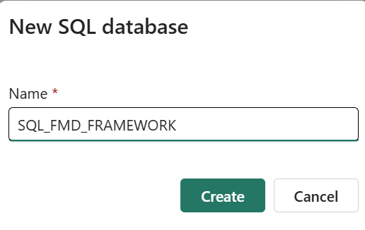

## Introduction

Fabric Metadata driven FRAMEWORK (short: FMD) is a solution xxxxxx
x:
- Features 


## FMD_FRAMEWORK Deployment

### Requirements

You need to have the Fabric Adminstrator Role fot his action
The admin settings below needs to be enabled:
- Users can create Fabric items
- SQL database (preview)​


The following steps need to be done:

### 1. Download Files

Download the three files 
- FMD_deployment.json : Contains all definitions to create all artifacts for the FMD_FRAMEWORK (Input for the notebook below)
- NB_FMD_SETUP_MULTI_ENV.ipynb : Creates all artifacts for the FMD_FRAMEWORK within Fabric Data Platform(baed on your configuration)
- NB_FMD_UTILS.ipynb: Contains all definition to Creates all artifacts
to your local machine.

or 

1. Clone this repository:
   ```bash
   git clone https://github.com/edkreuk/FMD_FRAMEWORK.git
   ```


### 2. Create and authorize Service Principal

Create a new service principal with client secret within Azure Entra ID, without any API permissions. 
Add the service principal to a group(SG_FABRIC_SERVICES) 

#### You need to have the Fabric Adminstrator Role fot his action

The admin settings below needs to be enabled and the above group needs to be assigned
- Service Principals can use Fabric APIs
- Service Principals can access read-only admin APIs


### 3. Create Connection

Create the following two connections using Service Principal authorization:
| | Connection |
|-------------| ------------- | ------------- |
|Connection Name| CON_FMD_FABRIC_ADMIN_API  |
|Connection Type|  Web v2  |
|Base Url  | https://api.fabric.microsoft.com/v1/admin  |
|Token Audience Url|https://api.fabric.microsoft.com|
|Authentification|Service Principal|

Write down the Connection ID for later usage.


### 4. Create Workspace and Config Lakehouse

- Create a new workspace "FMD_FRAMEWORK_CONFIGURATION" (Name is up to you)
- Create a new Lakehouse called "LH_CONFIGURATION"
- Within the files section, create a subfolder named "deployment"
- Upload the file "FMD_deployment.json" to the new folder


### 5. Import Notebooks

- Import the notebook "NB_FMD_SETUP_MULTI_ENV.ipynb" into the workspace
- Import the notebook "NB_FMD_UTILS.ipynb" into the workspace
- NB: Make sure your are in the Fabric Experience

 

### 6. Create a Fabric SQL Database
- Create a new Fabric SQL Database "FMD_FRAMEWORK_CONFIGURATION" (Name is up to you) in the workspace FMD_FRAMEWORK_CONFIGURATION(see number 4)


Write down the Artifact id and Workspace id for later usage.

Artifact id can be found in the URL when you open the database (sqldatabases/9)

Note: Currently there is no API available to create this automatically

### 6. Notebook Configuration

#### 6.1 Logging
    
#### 6.2 Configuration

#### 6.3 Environments

#### 6.4 Connections

#### 6.5 Workspace Roles

Deployment Configuration Script
This script is used to configure deployment settings for different environments (development and production) in a Fabric SQL Framework. Below is a detailed explanation of each section of the script.

1. Deployment File
deployment_file = 'deployment/FMD_deployment.json'
Purpose: Specifies the source file to read the deployment manifest from.
2. Capacity ID
capacity_id = '075e5656-1234-5678-a36c8c0e8bca'
Purpose: Unique identifier for the capacity to be used.
3. Fabric SQL Framework
workspace_sql = '7774469b-1234-5678-bc42-a36c8c0e8bca'
artifact_sql_framework = '075e5656-1234-5678-89ed-63f6837c0ff6'
workspace_sql: Identifier for the SQL workspace.
artifact_sql_framework: Identifier for the SQL framework artifact.
4. Workspace Roles
workspace_roles = [
    {
        "principal": {
            "id": "00000000-0000-0000-0000-000000000000",
            "displayName": "sg-fabric-contributor",
            "type": "Group"
        },
        "role": "Member"
    },
    {
        "principal": {
            "id": "00000000-0000-0000-0000-000000000000",
            "displayName": "sg-fabric-admin",
            "type": "Group"
        },
        "role": "Admin"
    }
]
Purpose: Defines roles to be added to the workspace. Each role includes:
principal: The group or user to which the role is assigned.
role: The role assigned to the principal (e.g., Member, Admin).
5. Logging Configuration
logging = {
    "log_workspace_guid": "7db968e8-e86b-488e-b5ac-ffca009c89d7",
    "log_warehouse_guid": "bebda8eb-0b5f-41e9-933b-1cfc1df648f4",
    "log_warehouse_endpoint": "nl7yhqnbrscude3yv6mas6bxpq-5buls7ll5chernnm77fabhej24.datawarehouse.fabric.microsoft.com"
}
log_workspace_guid: GUID for the logging workspace.
log_warehouse_guid: GUID for the logging warehouse.
log_warehouse_endpoint: Endpoint for the logging warehouse.
6. Configuration
configuration = {
    'workspace': {
        'name' : 'FMD_FRAMEWORK_DATA_MH2 (dvlm)',
        'roles' : workspace_roles,
        'capacity_id' : capacity_id
    },
}
Purpose: Defines the configuration for the workspace, including:
name: Name of the workspace.
roles: Roles to be assigned (defined earlier).
capacity_id: Capacity ID to be used.
7. Environments
environments = [
    {
        'environment_name' : 'development',
        'workspaces': {
            'data' : {
                'name' : 'FMD_FRAMEWORK_DATA (D)',
                'roles' : workspace_roles,
                'capacity_id' : capacity_id
            },
            'code' : {
                'name' : 'FMD_FRAMEWORK_CODE_MH2 (D)',
                'roles' : workspace_roles,
                'capacity_id' : capacity_id
            }
        },
        'connections' : {
            'CON_FMD_FSQL' : '372237f9-709a-48f8-8fb2-ce06940c990e',
            'CON_FMD_API_FABRIC' : '644f217a-8761-4f19-b1b7-a40bfe0ec2af',
            'CON_FMD_ASQL_01' : 'cf673e6a-13f6-4ebb-9cbb-4ba4ab390818',
            'CON_FMD_ASQL_02' : '11a8e5fe-fbca-4822-9ba4-9162cf56e6dd',
            'CON_FMD_ADLS_01' : 'a0581b6e-5e38-46eb-bab2-7f08e9a35c30',
            'CON_FMD_FABRICPIPELINES' : '6d8146c6-a438-47df-94e2-540c552eb6d7',
            'CON_FMD_ADF_PIPELINES' : '02e107b8-e97e-4b00-a28c-668cf9ce3d9a'
        }
    },
    {
        'environment_name' : 'production',
        'workspaces': {
            'data' : {
                'name' : 'FMD_FRAMEWORK_DATA',
                'roles' : workspace_roles,
                'capacity_id' : capacity_id
            },
            'code' : {
                'name' : 'FMD_FRAMEWORK_CODE_MH (prod)',
                'roles' : workspace_roles,
                'capacity_id' : capacity_id
            }
        },
        'connections' : {
            'CON_FMD_FSQL' : '372237f9-709a-48f8-8fb2-ce06940c990e',
            'CON_FMD_API_FABRIC' : '644f217a-8761-4f19-b1b7-a40bfe0ec2af',
            'CON_FMD_ASQL_01' : 'cf673e6a-13f6-4ebb-9cbb-4ba4ab390818',
            'CON_FMD_ASQL_02' : '11a8e5fe-fbca-4822-9ba4-9162cf56e6dd',
            'CON_FMD_ADLS_01' : 'a0581b6e-5e38-46eb-bab2-7f08e9a35c30',
            'CON_FMD_FABRICPIPELINES' : '6d8146c6-a438-47df-94e2-540c552eb6d7',
            'CON_FMD_ADF_PIPELINES' : '02e107b8-e97e-4b00-a28c-668cf9ce3d9a'
        }
    }
]
Purpose: Defines configurations for different environments (development and production). Each environment includes:
environment_name: Name of the environment.
workspaces: Workspaces for data and code, each with:
name: Name of the workspace.
roles: Roles to be assigned.
capacity_id: Capacity ID to be used.
connections: Various connection identifiers for the environment.


## Contributing

Contributions are welcome! If you have suggestions or improvements, feel free to open an issue or submit a pull request.

## License

This project is licensed under the MIT License.