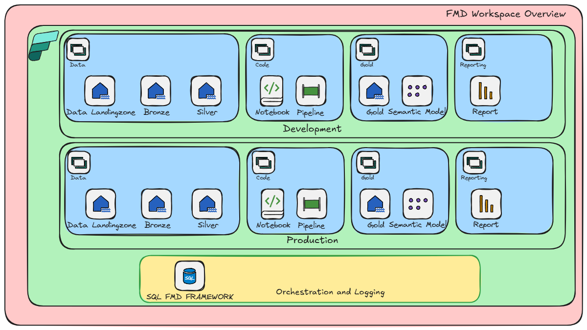
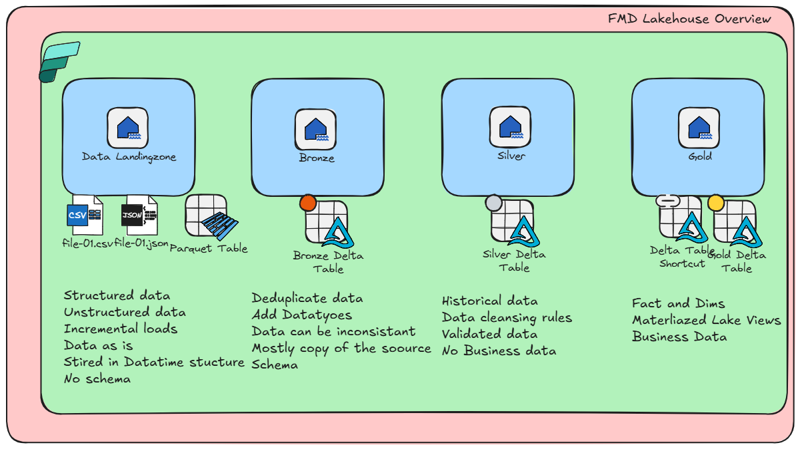

# Fabric Metadata-Driven (FMD) Framework overview

The Fabric Metadata-Driven (FMD) Framework is a scalable, extensible solution for managing, integrating, and governing data using a metadata-driven approach on Fabric SQL Database. This article provides an overview of the FMD Framework, including its architecture, core components, workspace structure, supported data sources, and deployment guidance.

## Overview

The FMD Framework enables organizations to streamline data operations by leveraging metadata to drive dynamic data pipelines and parameterized notebooks. Built on Fabric SQL Database, the framework supports secure, flexible, and modern data management at scale.

> [!TIP]
> The FMD Framework is designed for rapid deployment and extensibility. You can use it out-of-the-box or customize it to meet your organization's evolving data needs.

 

## Video with the Data Factory Team

## Key features

- **Comprehensive data governance:** Maintain detailed metadata for improved data quality, consistency, and compliance.
- **Scalability and flexibility:** Seamlessly scale with organizational growth and adapt to changing data requirements.
- **Streamlined data integration:** Integrate diverse data sources for a unified data landscape.
- **Cost efficiency:** Optimize data processes and reduce redundancy to achieve cost savings.

## Architecture and components

The FMD Framework uses a modular architecture that separates data, code, and orchestration for enhanced security and manageability.

### Workspace architecture

The recommended workspace structure ensures clear separation of responsibilities and access control.

| Workspace type              | Purpose                                      | Examples                        |
|-----------------------------|----------------------------------------------|----------------------------------|
| Data workspaces             | Manage and store data                        | Data Landing Zone, Bronze, Silver|
| Code workspaces             | Develop and manage code artifacts            | Data Pipelines, Notebooks, Spark |
| Orchestration & logging     | Orchestrate and monitor data operations      | Fabric SQL Database, Auditing    |

> [!NOTE]
> For organizations with a Gold Layer, create a separate workspace for reports to restrict access appropriately.

### Medallion architecture

The framework implements the Medallion Architecture using Lakehouses:

- **Data Landing Zone:** Stores raw, unstructured, and structured data with incremental loads and no enforced schema.
- **Bronze layer:** Deduplicates and structures data, applying schema for consistency.
- **Silver layer:** Maintains historical, validated data with enforced quality rules.

### Variable Library

The Variable Library centralizes the management of variables used throughout the FMD Framework. It is integrated with the `PL_LOAD_ALL` process, allowing parameters to be passed dynamically during execution.

**Currently supported variables:**
- `key_vault_name`
- `Lakehouse_schema_enabled`

Additional variables will be supported in future releases.

### Taskflow import

To deploy the default taskflow:

1. Import `FMD_FABRIC_TASKFLOW.json` from the Taskflow folder into your workspace.
2. Assign the correct artifacts to the taskflows as shown in the documentation.

## Supported data sources

The FMD Framework supports integration with the following sources:

- SQL Server (on-premises or cloud)
- Azure Data Lake Gen2
- SFTP / FTP
- Azure Data Factory
- Onelake tables and files

## Deployment and getting started

To get started:

1. Review the [FMD Framework Deployment Guide](./FMD_FRAMEWORK_DEPLOYMENT.md).
2. Import the taskflow and configure your workspaces as recommended.
3. Refer to additional resources for data model, pipelines, and logging.

## Additional resources

- [FMD Data Model reference](./FMD_DATA_MODEL.md)
- [FMD Framework Data Pipelines](./FMD_DATA_PIPELINES.md)
- [Configure and load demo data](./FMD_LOAD_BULK_DATA.md)
- [Auditing and logging](./FMD_DATA_LOGGING.md)
- [Data cleansing](./FMD_DATA_CLEANSING.md)

## Troubleshooting

- **Fabric SQL Database limitations:**  
  If deployment fails, verify that you haven't exceeded the allowed number of Fabric Databases in your tenant. Trial capacities are limited to three databases.

- **Error handling:**  
  If you encounter errors during deployment (for example, database creation failures), re-run the notebook or manually create the database to diagnose the issue.

## Contributing

We welcome contributions! To suggest improvements, open an issue or submit a pull request.  
If opening a pull request, please follow these steps:

1. Fork the repository.
2. Create a feature branch.
3. Commit your changes.
4. Push to the feature branch.
5. Create a pull request and add documentation on what you have changed.

## License

This project is licensed under the GNU GENERAL PUBLIC LICENSE.

---

**Contributors:**  
[Erwin de Kreuk](https://www.linkedin.com/in/erwindekreuk/)  
[Marco Hansma](https://www.linkedin.com/in/marcohansma/)